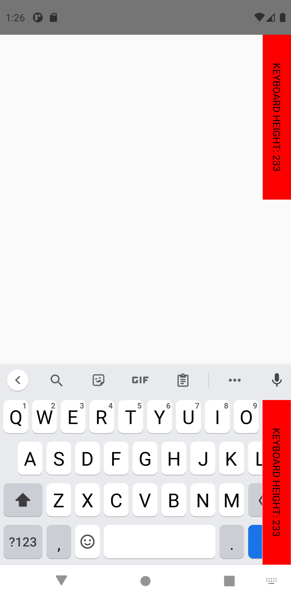
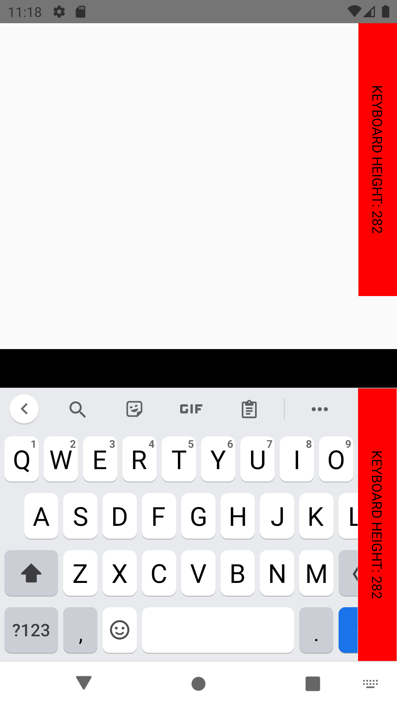

# Keyboard.addListener('keyboardDidShow', ...) callback is invoked with inaccurate measures in devices with notches on Android 10

## Incriminated API

``` js
// In Android
Keyboard.addListener('keyboardDidShow', e => {
    e.endCoordinates.height // ← On OnePlus 7, and Pixel 3XL (simulator) this value is underestimated by exactly StatusBar.currentHeight.
})
```

## Prerequisites

In `AndroidManifest.xml`, set `android:windowSoftInputMode="adjustPan"`.

## Visual tests

*The red vertical bar should be the same height as the keyboard. You should see a black bar at the top of the soft keyboard with a height equal to the red vertical bar width.*

**Remarks**: *In the below screenshots, the red vertical bar has been duplicated to the bottom for easy comparison of heights.*


<table>
    <tr>
        <th>Emulator, Pixel 3 XL, Android 10 (simulator)</th>
        <th>Nexus 5X, Android 10 (simulator)</th>
    </tr>
    <tr>
        <td valign="top"></td>
        <td valign="top"></td>
    </tr>
</table>


## Run tests

*You need to run the project on a device with a notch (such as Pixel 3XL).*

