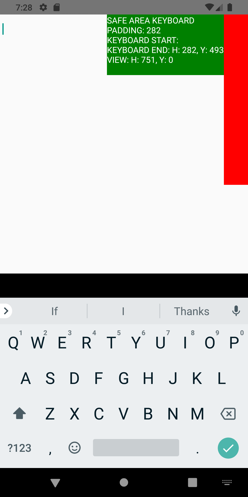
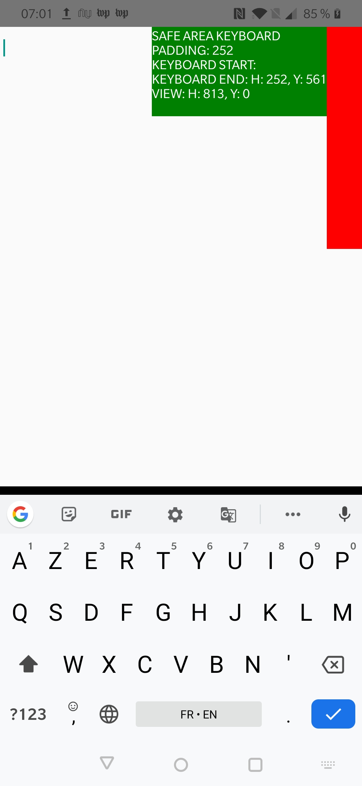

# Keyboard.addListener('keyboardDidShow', ...) callback is invoked with inaccurate measures in OnePlus 7, Android 10

## Incriminated API

``` js
// In Android
Keyboard.addListener('keyboardDidShow', e => {
    e.endCoordinates.height // ← On OnePlus 7, this value is underestimated by approximately 30 dp.
})
```

## Prerequisites

In `AndroidManifest.xml`, set `android:windowSoftInputMode="adjustPan"`.

## Visual tests

*The black horizontal bar should be the same width (40dp) as the red bar, in a container with a bottom padding of the keyboard's height. This component mimics KeyboardAvoidingView with behavior padding set. The height of keyboard should be the same as the height of the red bar. The issue has been reproduced with GBoard, SwiftKey...*

**Remarks**: *I would have imagined that the view height would equal keyboard height + keyboard Y. But that is only true ... on OnePlus7, which is the problematic device!*

| Emulator, Pixel 2 XL, Android 10 | OnePlus 7, Android 10, OxygenOS 10.0.1 |
|:-------------:|:-------------:|
|  |  |


## Run tests

*You need a OnePlus 7 with Android 10 to witness the discrepancy. It might well be the same on OnePlus 7 Pro.*

